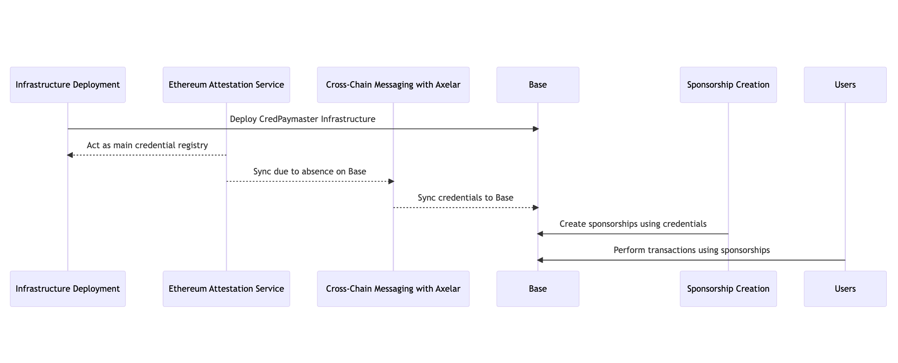

# CredPaymaster

## Live App

https://cred-paymaster.vercel.app/

## Demo Video

https://youtu.be/yEw6GqCrhB4

## Pitch Deck

https://docs.google.com/presentation/d/1VATNJZiPF8jrDr6Ahv0aCrLEOPYuhF0P3L9WhnuH8uI/edit?usp=sharing

## Description

**CredPaymaster** is a credential-based account abstraction paymaster system designed to provide a flexible way to manage paymasters using credentials for the Base chain. Built atop the Ethereum Attestation Service for credential registry, it capitalizes on the power of decentralized solutions to enhance the chain's ecosystem.

## Benefit

By employing CredPaymaster, users can:

- Provide a seamless way for sponsors to create sponsorships based on certain credentials.
- Enable users with the required credentials to benefit from free transactions under these sponsorships.
- Attract more users to their ecosystem with a flexible paymaster system.

## How it works

1. **Infrastructure Deployment**: The entire account abstraction infrastructure of CredPaymaster is deployed on Base.
2. **Utilizing Ethereum Attestation Service**: This service acts as the main credential registry. However, due to the absence of an Ethereum Attestation Service on Base, there arises a need to sync credentials.
3. **Cross-Chain Messaging with Axelar**: To bridge the gap, CredPaymaster uses Axelar as the cross-chain messaging protocol. This ensures that credentials are seamlessly synced from the Ethereum Attestation Service to Base.
4. **Sponsorship Creation**: Sponsors have the ability to create sponsorships for the paymaster using specific credentials.
5. **Free Transactions for Users**: Users who possess the necessary credentials can perform transactions without any cost, leveraging the sponsorships created.

## Reference

### Created EAS schema

https://optimism-goerli-bedrock.easscan.org/schema/view/0x609d299dc1b4745bee41ff5d4545221b459f868e52394452be275b8471fedcf8

### Created EAS Attestation

https://optimism-goerli-bedrock.easscan.org/attestation/view/0xfbdaa8f9936d41a3c6791afa8b3acb74a808cd3f77cada5b3be27189b447f891

### Attestation Sync Tx with Axelar

https://testnet.axelarscan.io/gmp/0x73e1beb8f59940dc1eb7d5f536f6d9757ce0b475f99a27030ab70a190e7bb039

### Success Account Abstraction Tx

https://www.jiffyscan.xyz/userOpHash/0x509edcd975ea252b529f32001d600330a625eab50e761f4b647b4f6b210f62bf?network=base-testnet
